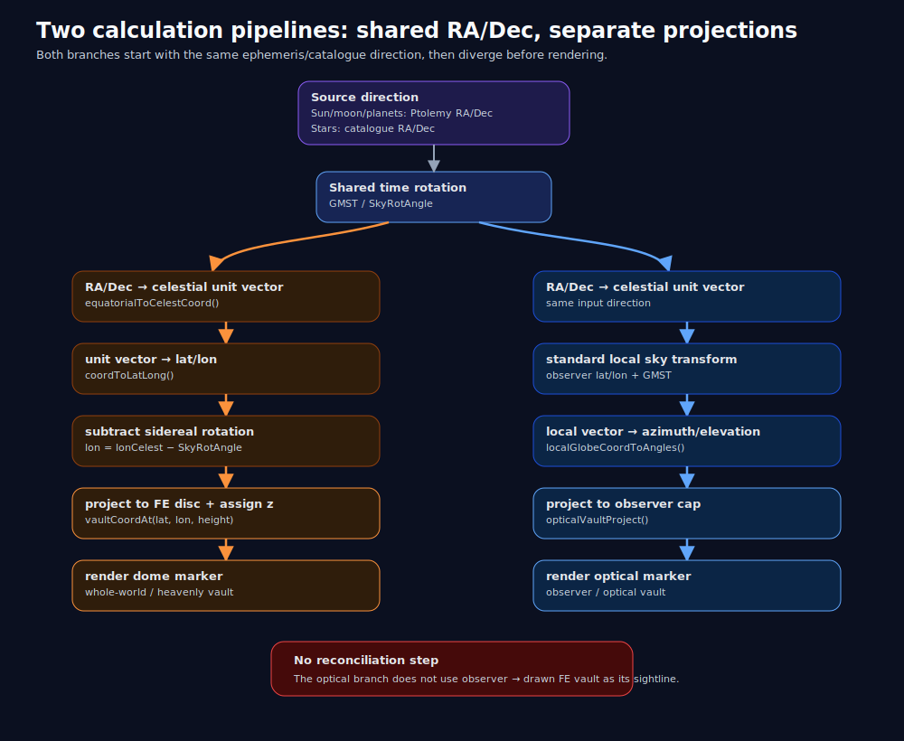
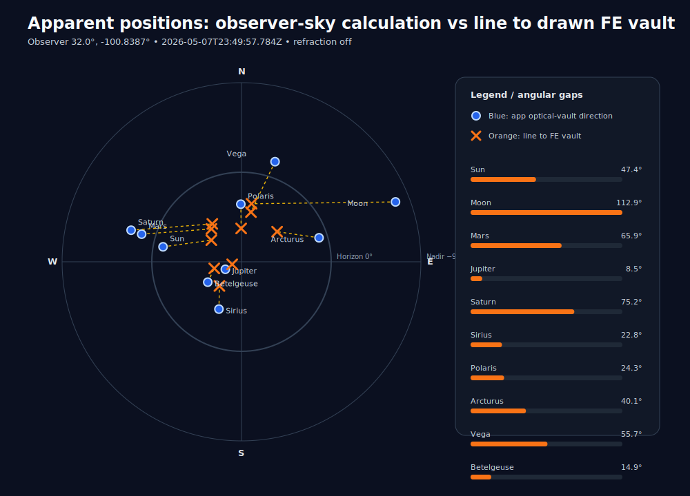
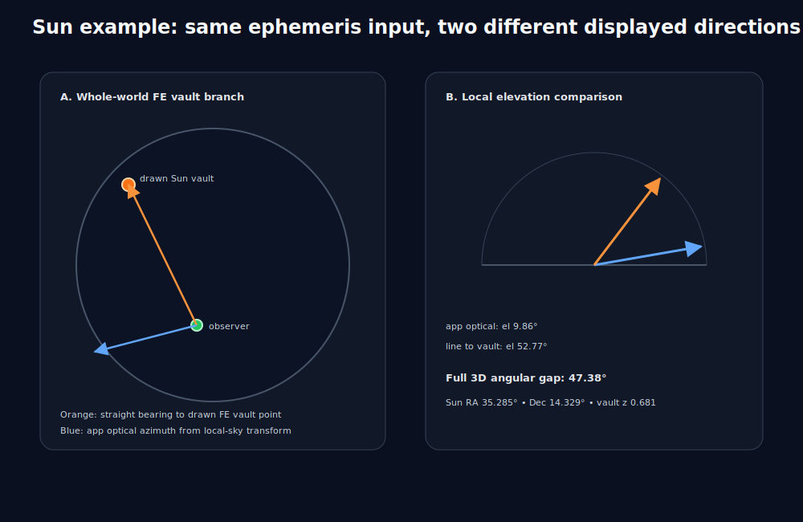
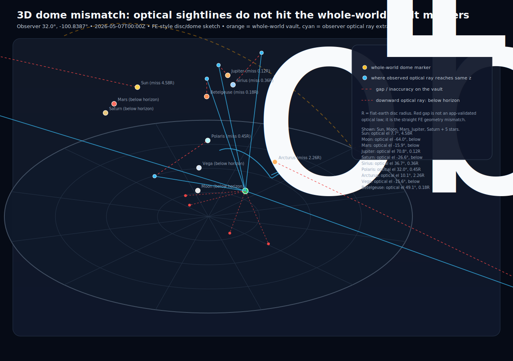

# Conceptual Flat Earth Model — Investigation and Visual Pipeline Report

This folder preserves the investigation work for [`stpierrs/conceptual_flat_earth_model`](https://github.com/stpierrs/conceptual_flat_earth_model/) in the main `experiments` repository so it can be reviewed in a real PR here.

## Investigation outcome

The audited app presents two dome/vault visualizations that share the same source RA/Dec values and sidereal time, but the observer optical dome is not calculated as the observer's line of sight to the displayed flat-earth heavenly vault.

In short:

1. **Whole-world / heavenly-vault branch**: RA/Dec is converted to celestial latitude/longitude, sidereal rotation is subtracted, that lat/lon is projected onto the FE disc, and a model/display `z` height is assigned.
2. **Observer / optical-vault branch**: the same RA/Dec is transformed with the standard local-sky spherical astronomy matrix into azimuth/elevation, then drawn on the observer's local optical cap.
3. The app does **not** reconcile those branches by computing a sightline from the observer's FE coordinate to the rendered FE vault coordinate.

The original cloned working tree disappeared from this environment before a real GitHub PR existed, so this folder is the durable PR payload in the `experiments` repo: investigation notes, sample data, visual assets, and a visual-generation script.

## Visual 1 — Pipeline split



Both branches start from the same source direction and sidereal rotation, then split into different projections. The missing red-box step is the core issue: no step takes the drawn FE vault point and derives the optical-vault direction from it.

## Visual 2 — Apparent position mismatch



For the deterministic sample below, blue dots are the app's optical-vault directions and orange X marks are straight line-of-sight directions to the drawn FE vault points.

- Observer: `32.0°`, `-100.8387°`
- Date/time: `2026-05-07T00:00:00Z`
- Refraction: off
- Sun/moon/planets: Ptolemy-only ephemeris path described in the audited app

| Body | App optical az/el | Straight line to FE vault az/el | Angular gap |
|---|---:|---:|---:|
| Sun | 281.77° / 7.67° | 307.13° / 52.09° | 49.04° |
| Moon | 88.13° / -64.04° | 19.93° / 30.93° | 108.82° |
| Mars | 286.55° / -15.90° | 318.91° / 44.83° | 67.49° |
| Jupiter | 247.72° / 70.80° | 257.29° / 79.54° | 9.05° |
| Saturn | 286.99° / -26.59° | 323.51° / 41.71° | 76.19° |
| Sirius | 207.12° / 36.72° | 225.05° / 56.60° | 23.22° |

Most sampled bodies are separated by tens of degrees. Jupiter is closer in this particular snapshot, but that is a coincidence of geometry for that body/time/observer, not evidence of a single consistent FE optical pipeline.

## Visual 3 — Sun example



The Sun example shows the difference in a concrete way:

- The orange direction is the straight line from the observer to the rendered FE vault point.
- The blue direction is the app's optical-vault direction from the local-sky transform.
- For the same Sun RA/Dec, the app optical elevation is `7.67°`, while the straight line to the drawn FE vault point is `52.09°`; the full angular gap is `49.04°`.


## Visual 4 — 3D ray mismatch on the flat map



This 3D-style view puts the flat map, the whole-world dome, the observer's local optical dome, and the optical sightlines in one frame. Orange/yellow points are the whole-world vault markers. Cyan paths show rays projected from the observer through the observed optical-dome positions and out toward the whole-world vault. Red dashed segments show the remaining miss distance. Downward red rays mark below-horizon optical positions that cannot reach the upper dome in straight FE geometry.

The scene uses the cloned app source's default observer position and a default-load date snapshot generated from the app model. It includes the Sun, Moon, Mars, Jupiter, Saturn, and five bright stars (Sirius, Polaris, Arcturus, Vega, and Betelgeuse) so the mismatch is visible without turning the diagram into a cloud of labels. Large off-map misses are clipped and labeled rather than drawn as giant confusing diagonals.

## Future app-integration brainstorm

Do **not** implement this yet, but the visualization suggests a useful debug overlay for the original app:

- Add a toggle such as `Show FE sightline error`.
- For each tracked body, draw the straight ray from the observer through the current optical-vault marker.
- Mark where that straight ray intersects the body's whole-world vault-height plane or dome shell.
- Draw a red miss segment from that intersection to the body's actual whole-world vault marker.
- Optionally draw a distinct curved/warped ray from the whole-world marker to the observed optical position, clearly labeled as a hypothetical/required bending path rather than a modeled optical law.

That would make the mismatch inspectable inside the app without claiming the curved ray is physically justified.

## Code-path summary from the audited app

### Source data/equations

The app's current body source is effectively Ptolemy-only for Sun, Moon, Mercury, Venus, Mars, Jupiter, and Saturn. The source comments in the audited repo state that the router had been reduced to one pipeline, while `ephemerisPtolemy.js` still contains stale language describing Ptolemy as comparison/fallback-only and historically approximate.

### Whole-world / heavenly-vault branch

```text
RA/Dec
→ equatorialToCelestCoord({ ra, dec })
→ coordToLatLong(celestial vector)
→ vaultCoordAt(lat, lonCelest − SkyRotAngle, selectedHeight)
→ render dome/heavenly-vault marker
```

The selected height is not solved from the observer's measured elevation:

- Sun: declination normalized into a small band above the starfield floor, capped by the vault ceiling.
- Moon: Sun height plus a lunar ecliptic-latitude offset.
- Planets: Sun height plus a planetary ecliptic-latitude offset.
- Stars: fixed starfield vault height.

### Observer / optical-vault branch

```text
RA/Dec
→ equatorialToCelestCoord({ ra, dec })
→ compTransMatCelestToGlobe(observerLat, observerLon, SkyRotAngle)
→ celestCoordToLocalGlobeCoord(...)
→ localGlobeCoordToAngles(...)
→ opticalVaultProject(localGlobe, opticalRadius, opticalHeight)
→ render optical-vault marker
```

That is a normal planetarium-style local sky calculation. It is independent of the rendered FE vault coordinate.

### The missing bridge

The audited codebase included a helper named `feConceptualLocalGlobeUnit(vaultGlobalFe, observerGlobalFe, transMatLocalFeToGlobalFe)`. Conceptually, that is the calculation needed to connect the FE vault to the observer view: subtract observer position from the drawn vault position, express the vector in local observer axes, and normalize it.

The main optical render paths for Sun, Moon, planets, and stars do not use that bridge. This is why the blue app-optical positions and orange line-to-vault positions can diverge dramatically.

## Files in this folder

- `README.md` — this report.
- `source/` — dead cloned text/source-code snapshot of `stpierrs/conceptual_flat_earth_model`, with binary image assets intentionally omitted.
- `pipeline-sample-data.json` — deterministic sample values used by the visuals.
- `generate_sample_data.mjs` — regenerates sample data from the cloned app modules using the committed default-load snapshot; pass `--use-app-now` to refresh from the app's dynamic current-date default.
- `generate_visuals.py` — regenerates the three 2D SVG visuals from the JSON data.
- `generate_3d_dome_visual.py` — regenerates the 3D-style dome/ray mismatch SVG.
- `visuals/pipeline-overview.svg` — visual pipeline split.
- `visuals/coordinate-mismatch.svg` — observer-sky mismatch chart.
- `visuals/sun-pipeline-geometry.svg` — Sun-specific FE disc/elevation example.
- `visuals/dome-ray-mismatch-3d.svg` — 3D-style flat-map/double-dome ray mismatch scene.
